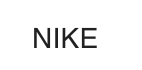
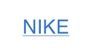
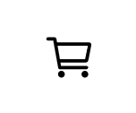
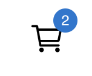
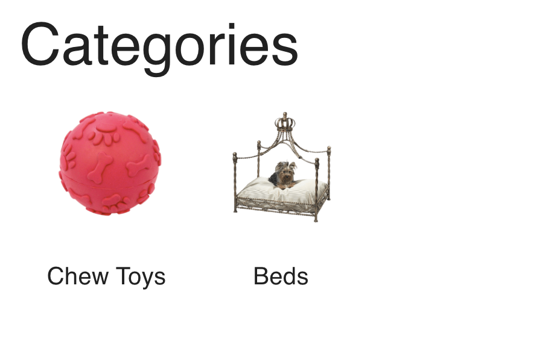
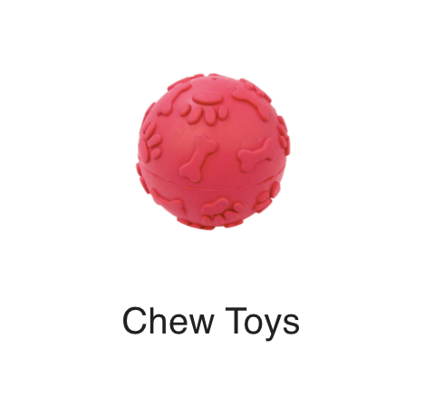
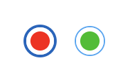
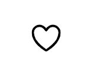
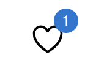

# @ditus/react-web-retail

[](LICENSE.md)
[](https://github.com/ditus-software/react-web-retail/actions/workflows/node.js.yml)
[](https://coveralls.io/github/ditus-software/react-web-retail?branch=master)
[](CODE-OF-CONDUCT.md)

This repo contains UI components based on Material UI for use in web-based
retail applications. The repo is open source and will remain so. All components
have multi-language/translation support and can be themed.

## Installation

```bash
npm i @ditus/react-web-retail
```

## Demo

To view the components, type:

```bash
npm i
npm run storybook
```

## Components

The following components are included in the package. For demo's and to view
components in actual size, run storybook as indicated above. Some components are
internal and are not listed here since they are not exposed. If you don't see a
component that you believe should be here or you would like to see an internal
component made external, submit a request and we will respond promptly.

### Brand Link

Displays the brand name of a product.



It can also be displayed as a link, if there are many products of the same
brand:



### Cart Empty

The Cart Empty component displays a message stating that the customers shopping
cart is empty.


### Cart Icon

The Cart Icon component displays a shopping cart icon that can be clicked to
redirect the customer to their shopping cart.



The Cart Icon with a badge specifying the number of products in the shopping
cart:



### Choking Hazard

The Choking Hazard component displays a warning on products that contain small
parts and could be harmful to younger children.


### Featured Product Attributes

The Featured Product Attributes component displays a subset of product
attributes that consumers would be more interested in.


### Featured Taxonomies

The Featured Taxonomies component displays related taxonomies used to categories
products. Customers would usually click a taxonomy to view all products within
that category.



### Featured Taxonomy

The Featured Taxonomy component displays a single category or taxonomy of
products, such as dog toys or cat food.



When the mouse is hovered over the component, it appears as:


### Low Stock

The Low Stock component displays a message when a product is low on quantity.


### Price

The Price component displays the price of a product.


### Product Attribute

The Product Attribute component displays a single name/value pair representing
an attribute of the product, such as the product's color or dimensions.


### Product Attributes

The Product Attributes component displays a list of product attributes.


### Rating Linear Progress

The Rating Linear Progress component displays a styled Linear Progress bar that
displays the rating for a product.


### Rating Summary

The Rating Summary component displays the ratings for a product broken down by
star rating, including the average rating and total number of ratings.


### Rating Summary Bar

The Rating Summary Bar component displays the ratings for a single star (1
through 5) on the Rating Summary component.


### Save Coupon

The Save Coupon component displays a message indicating how much the consumer
will save with a coupon that is automatically applied at checkout.


### Sponsored

The Sponsored component displays the word 'sponsored' and is meant to be
displayed when a product is promoted for advertising reasons.


### Swatch

The Swatch component displays a variant color or material for a product using a
solid color or image.

This is an example of a solid color:


This is an example of an image:


### Swatches

The Swatches component displays one or more swatches.



### Wish List Icon

The Wish List Icon component displays a wish list icon that can be clicked to
redirect the customer to their wish list.



The Wish List Icon with a badge specifying the number of products in the wish
list:



## Roadmap

See the [open
issues](https://github.com/ditus-software/react-web-retail/issues) for a
list of proposed features (and known issues).

## License

This project is licensed under the terms of the [MIT license](LICENSE.md).
